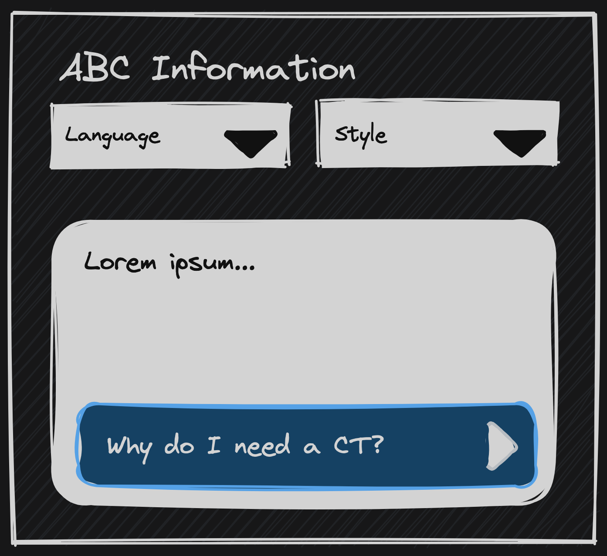
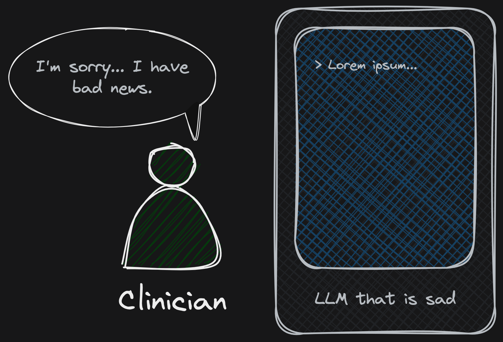
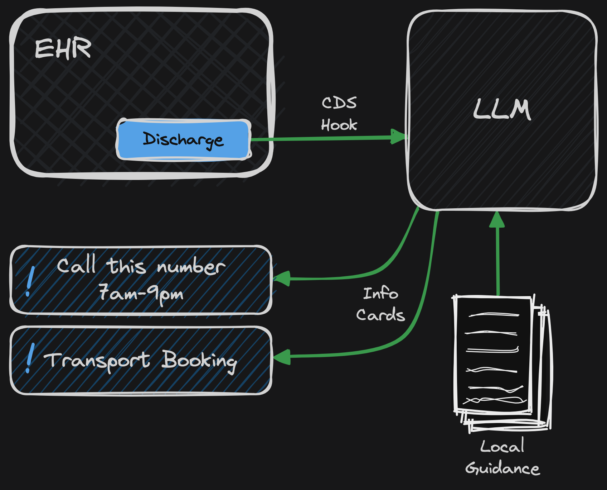

# Group Ideas - High Priority Use-case Focus

## Group 1 - Patient Education and Engagement
#### Title + Description of idea
Patient notification information tailoring (language and comprehension level) with a question answer component, like “What happens next? What a CT?”

#### Problem it solves + for whom
- `Improved compliance = increase in better outcomes`, `reduced explanation time = reduced consultations`
- Increase confidence for patient and reduced time burden for doctors

#### Outcome for user
- As above
- Tailored printed info + interactive online info

#### Sketch

---

## Group 2 - Clinical Education
#### Title + Description of idea
**LLM to simulate breaking bad news**

#### Problem it solves + for whom
Medical students learn how to break bad news to patients. This could be used to help students learn how to do that. Tailored for different personalities and types of conversations.

#### Sketch

### Use case canvas
#### User Focused
> Who are our users and most valuable service users?

Anyone who has to give bad news:
- HCP (doctor)
- Med students
- Managers? (extend)

Payment (bugs, installs)
- Uni
- Trust
- Individuals

#### Value Proposition
> What ‘need’ exists that this use case can provide a unique, differentiated solution? What business value will be created?

- Scaling actors and workshops
- Embarrassment could aid need
- Empathy gap
- Variation in quality of existing actor
- Scales personas cheaper, easier
- Risk to patient is low

#### Business Viability
> How will this solution impact our business? What does the data show us? What are the risks? How does this meet the NHS long term plan?

- Validate approach in different personas (hard)
- Availability of training data
- Does it perform worse?
  - Complaints department
  - University assessment
- Risk of stereotypes with personas

### Technical Feasibility
#### Technical Components and Requirements
> What functional/technical items will be required to implement this use case? What systems require integration and for what? What information, data, algorithms, etc. are needed?

- Scenario generation (possibly LLM already)
- Good and bad examples (videos already exist - would need access)
- Persona generation and accurate portrayal (hard) - use medical dramas as examples?
- Blocks on stereotypes might make it hard to create personas (e.g Bard
blocks on trying to create cultural stereotypes e.g adapting for US/UK
audiences)
- Not a lot of systems integration needed

#### Implementation Notes
> What other service user experience, interface, or implementation notes need to be taken into account?

- Cheap, scaleable 
- Low risk if suboptimal

#### Prototype Scope
> What of the technical components and implementation notes will be implemented for the prototype?

TTS/ASR could be harder in demo

---

## Group 3 - Operational planning and demand predictions
#### Title + Description of idea

1. **Summarise discharge-relevant information from notes**
2. **Summarise patient resource needs (what’s needed next) from ALL EHR data**
3. **Surface relevant SOPs + guidance in the EHR**

#### Problem it solves + for whom
1. Insight into what is blocking discharge are hard to synthesise
2. Better routing and prioritisation of hospital resource
3. Communication between bed planners/clinicians

#### Outcome for user
Actionable information to mobilise relevant team in a prioritised way

#### Sketch

### Use case canvas
#### User Focused
> Who are our users and most valuable service users?

Users are ward staff but the primary beneficiaries are the operational teams seeking to influence/prioritise

#### Value Proposition
> What ‘need’ exists that this use case can provide a unique, differentiated solution? What business value will be created?

- Fewer barriers to discharge
- Operational efficiency

#### Business Viability
> How will this solution impact our business? What does the data show us? What are the risks? How does this meet the NHS long term plan?

- Unadopted
- Difficult to change staff behaviours

### Technical Feasibility
#### Technical Components and Requirements
> What functional/technical items will be required to implement this use case? What systems require integration and for what? What information, data, algorithms, etc. are needed?

- EHR configuration
- Can we get access to an EHR-like environment - sandbox

---

## Group 4 - Data Analyst / Engineer knowledge base & education
#### Title + Description of idea
**NHS technical knowledge base**

#### Problem it solves + for whom
Diagnostic analyst: Which SMEs do I need to speak to for xyz
- Physiological GI dashboard (Diagnostic)
- Mental Health data
Re. SMEs - There is SME information documented for this in PDFs

#### Sketch
[TO INSERT]

### Use case canvas
#### Value Proposition
> What ‘need’ exists that this use case can provide a unique, differentiated solution? What business value will be created?

Some of the visualisation is easier to developer in Power BI instead of Tableau -> decision making based on what is the question based on and how it can be implemented in the best possible tool

#### Business Viability
> How will this solution impact our business? What does the data show us? What are the risks? How does this meet the NHS long term plan?

On Risks:
- Limitation to access of datasets
- Increase the questions from different Regional perspectives

### Technical Feasibility
#### Prototype Scope
> What of the technical components and implementation notes will be implemented for the prototype?

CHATBOT:

RAG: [Datasets] 
- NHS Futures?
- SME information?

QUERY: Example template from clinical team

---

## Group 5 - Clerical/administrative burden
#### Title + Description of idea
**Pharmaceutical financially data reporting Co-pilot for admin/clinical codes**

#### Problem it solves + for whom
- Pharmacists/business intelligence analyst 
- Reduces manual reviewing/checking of reports for accuracy/completeness

#### Outcome for user
Reduced time spent reviewing coding data

#### Sketch
[TO INSERT]

### Use case canvas
#### User Focused
> Who are our users and most valuable service users?

Staff involved in financial billing of medicines to NHSE i.e. pharmacists, business intelligence, finance teams

#### Value Proposition
> What ‘need’ exists that this use case can provide a unique, differentiated solution? What business value will be created?

- Alleviate administrative burden of clinical and financial staff
- Optimise use of specialist staff time on more valuable/creative endeavours

#### Business Viability
> How will this solution impact our business? What does the data show us? What are the risks? How does this meet the NHS long term plan?

- Clinical staff released for clinical work
- Reduced resource spent on end of month processes
- Staff released to work on more valuable generative efforts

### Technical Feasibility
#### Technical Components and Requirements
> What functional/technical items will be required to implement this use case? What systems require integration and for what? What information, data, algorithms, etc. are needed?

- Synthetic pharmaceutical dispensing data broken down by drug, cost code, values 
- LLM model accepting csv/xls as input
- No systems integration required
- Ability to fine tune towards medicines info

#### Implementation Notes
> What other service user experience, interface, or implementation notes need to be taken into account?

User interface to review and process errors and to complete fields

---

## Group 6 - Insights Generation
#### Title + Description of idea
**Analyst support tool with feedback loop**

Chatbot to `agents` with responsibility for different aspects of `fact finding` and `rationalising`

1. LLM interface to multiple NHS and public health data sources - NHS data lake for analysis
2. Generates key insights. Automated dashboard/analytics narrative pulled/created by LLM for national and local picture of NHS system

#### Problem it solves + for whom
- Simplified disparate systems
- Source of information
- Leaves analyst to finalise outputs and conclusions

Quickly gets analysts information using natural language Reduces time search through sources

Provides speedy access to bigger strategic picture for execs and analysts to extract key information

#### Outcome for user
- More time to spend reviewing and diving deeper 
- More consistencies of narrative generation

#### Sketch
[TO INSERT]

### Use case canvas
#### User Focused
> Who are our users and most valuable service users?

- C-suite/Executives
- Data analysts
- Local performance leads

#### Value Proposition
> What ‘need’ exists that this use case can provide a unique, differentiated solution? What business value will be created?

Execs:
- Timeliness
- Better intelligence (insights that wouldn’t otherwise be discovered)
- Execs develop better knowledge of data
- Ask the most relevant questions rather than just what has always been reported
- Better insights as they can add in contextual info

Data analyst:
- Time-saving
- Productivity
- Quick turnaround

#### Business Viability
> How will this solution impact our business? What does the data show us? What are the risks? How does this meet the NHS long term plan?

- Incorrect information
- Too much information 
- Hallucinations that get surfaced publicly

### Technical Feasibility
#### Technical Components and Requirements
> What functional/technical items will be required to implement this use case? What systems require integration and for what? What information, data, algorithms, etc. are needed?

Data:
- Could start with publicly available aggregated dataset published by NHS, gov.uk, GIRFT, Model hospital
- Various data types - csv, excel, table in word doc
- Incorporate metadata and data dictionaries

Show example queries

#### Implementation Notes
> What other service user experience, interface, or implementation notes need to be taken into account?

- Need to consider how users provide the contextual data (e.g. upload csv)
- What does the output look like if we need something beyond text?
- LLM produce python notebook?
- Notebook output converts chats to PDF or slides?

---

## Group 7 - Insights Generation 2
#### Title + Description of idea
**Use natural language to get and find information from published material**

- Users struggle to locate information in reports
- Reports don’t always include everything that users might want to know
- Users writes natural language, it’s interpreted and returns a natural language summary, charts or datasets
- Putting in standard statistical language and explanation of it
- Read a board report of text, numbers and charts and summarize the important points

#### Problem it solves + for whom

- Mainly for front-line managers
- Saves considerable time in producing reports and then missing the interpretation part
- Make it apparent to user e.g region lead log and it will give their regions as a summary
- More grammatical insights that change
- Board members
- Users of a published report who find it difficult to find what they need. Could be citizens. Could be exerts. Could be other analysts.

#### Outcome for user

- More appropriate measures and outcomes
- Increase communication related to NHS
- Analysts themselves to check through the “meaning” of the reports they are producing

#### Sketch
[TO INSERT]

### Use case canvas
#### User Focused
> Who are our users and most valuable service users?

- ICS regional leads
- GPs
- Smoking cessation policy makers
- Public health
- Other analysts/secondary analysts

#### Value Proposition
> What ‘need’ exists that this use case can provide a unique, differentiated solution? What business value will be created?

- Information overload in reports
- Currently, analysts asked to help interpret reports where not understood by end users
- Analysts have limited time - much is spent on producing these reports
- Too much data for many people
- New insights - better targeted to individual needs. Not `one summary fits all`

#### Business Viability
> How will this solution impact our business? What does the data show us? What are the risks? How does this meet the NHS long term plan?

- Less requests back to the analyst 
- Higher satisfaction from the service; people get exactly what they need 
- Faster access to information - quicker decision making

Risks:
- We will be able to replicate it
- LLM challenges dealing with numerical information
- Need to be clear on the boundaries for what people can ask (can these be defined and explained properly?) 
- Wrong information is generated (hallucinations)
- People get what they ask for, but don’t get sufficient contextual info as well 
- Users request is too complicated/not clear enough; the response fails/is not what was asked for

### Technical Feasibility
#### Technical Components and Requirements
> What functional/technical items will be required to implement this use case? What systems require integration and for what? What information, data, algorithms, etc. are needed?

- We have to track who logs in and who they are - track info when they request access 
- We have broad data that needs filtering down
- We will have lots of stakeholders to make the data relevant to them
